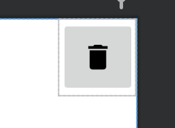
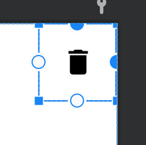
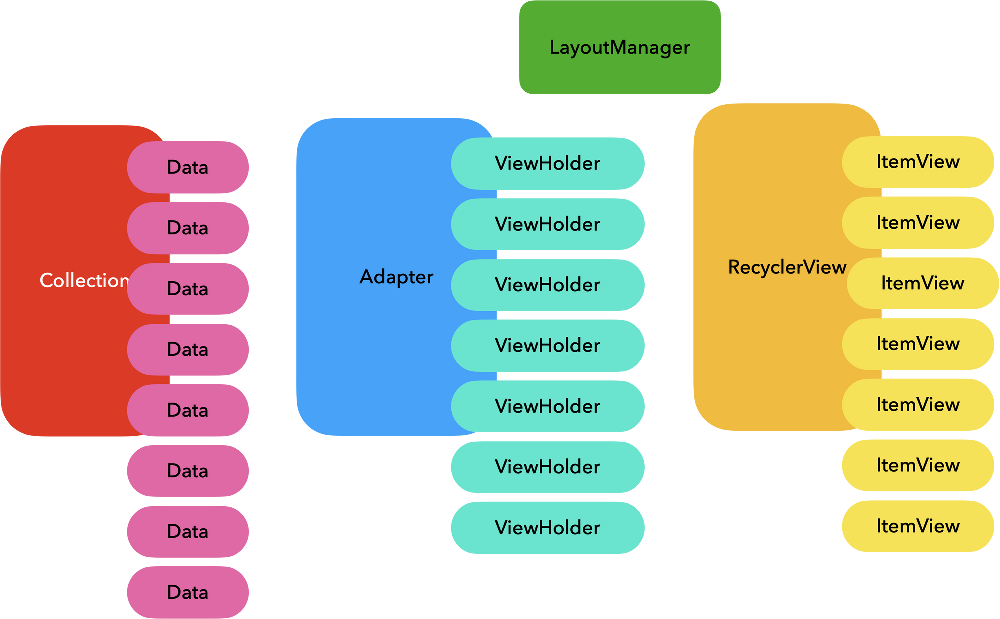
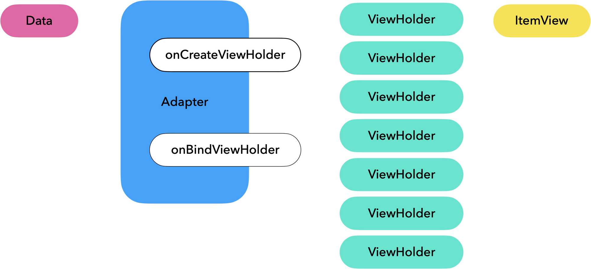

## 1. Button을 ImageView로 구성한 이유

#### 만일 Button을 `ImageButton`으로 구성할 경우 다음과 같습니다.

```xml
<ImageButton
        android:id="@+id/btn_delete"
        android:layout_width="wrap_content"
        android:layout_height="wrap_content"
        android:src="@drawable/baseline_delete_24"
        android:padding="16dp"
        app:layout_constraintTop_toTopOf="parent"
        app:layout_constraintEnd_toEndOf="parent" />
```



- `ImageButton`의 경우 자동으로 배경(Background)이 생성되며 해당 배경을 지워주는 작업을 추가로 해야 합니다.

#### 만일 `ImageView`로 구성할 경우 다음과 같습니다.

```xml
<ImageView
        android:id="@+id/btn_delete"
        android:layout_width="wrap_content"
        android:layout_height="wrap_content"
        android:src="@drawable/baseline_delete_24"
        android:padding="16dp"
        app:layout_constraintTop_toTopOf="parent"
        app:layout_constraintEnd_toEndOf="parent" />
```



- `ImageView`의 경우 배경이 추가되지 않습니다.

#### ImageButton은 불필요한 추가 기능이 많아서 코드의 복잡도를 증가시킬 수 있습니다.

예를 들어, ImageButton은 클릭 이벤트 처리를 위해 OnTouchListener와 OnFocusChangeListener 등의 이벤트 처리 메서드가 필요합니다.

반면, ImageView를 사용하여 버튼을 만들 경우에는 OnClickListener 하나로 모든 이벤트 처리가 가능합니다.

---

### 추가: `Padding`

또한, Button을 구성할 때는 `width`와 `height`를 각각 `48dp`로 설정해야 의도적인 클릭이 가능하다는 구글의 권장 최소 사이즈가 있습니다.

해당 이미지의 크기가 `24dp`이기 때문에, 클릭 시 불편함이 없도록 최소 `12dp`의 `padding`을 주는 것이 적절해 보입니다.

## 2. RecyclerView



### Adapter 주요 메서드

